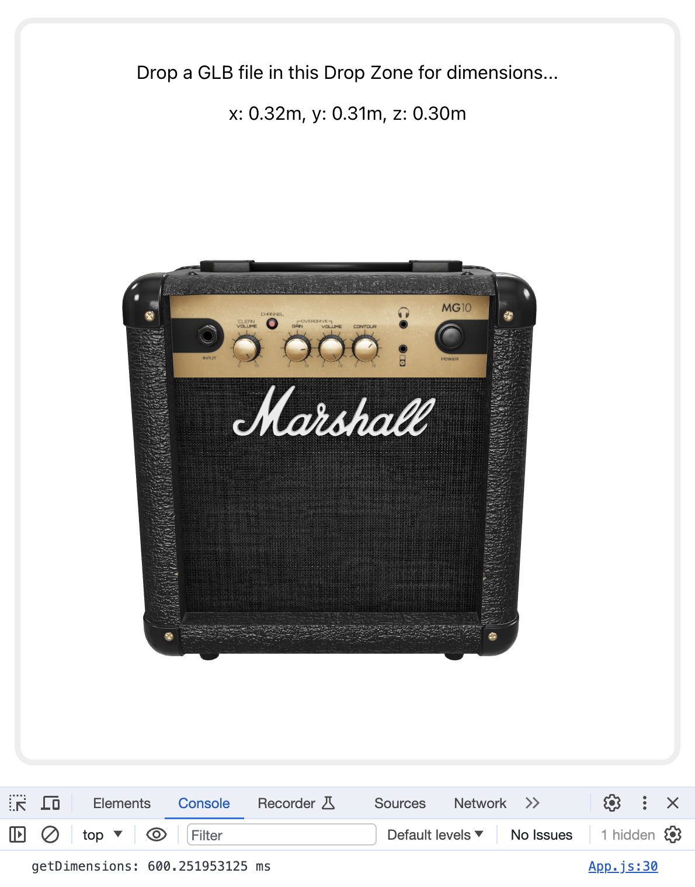
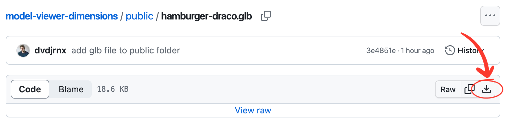

# dvdjrnx.github.io

 

Hi, I'm David Journeaux, a **front-end developer** and growing **UX/UI designer**. I've created this simple GitHub Pages site to hold a collection of minor projects I've worked on over the years.

To be frank, my most recent professional development and growth has occurred within two private endeavours:

- Building features for **Shopify** as one of their software engineers
- Creating prototypes for my own passion project, **The Altered**.

In light of this, I've not done much that reflects my current skillset within the public sphere. It's my hope this site will help to change that, presenting new, public projects that demonstrate my expertise and learnings in development and user experience with time.

I hope you’ll appreciate and enjoy the journey as much as I intend to myself.

 
 

## Small prototypes

 

### [Model Dimension Extraction Test](https://dvdjrnx.github.io/model-viewer-dimensions)

> **Tech used**: Google Model Viewer, React, JavaScript, HTML, CSS
> 
> **Note**: This prototype is best viewed on desktop or laptop screens

 

#### Project summary

A quick and dirty prototype of a Google Model Viewer-based 3D model dimension extractor.

Read more

 

This project was a prototyping test explored as part of my 3D and AR/VR work with Shopify. It tested model-viewer's `getDimensions()` method for performance viability in a project that required quickly assessing a model's dimensions to facilitate further business logic down the line.

The prototype mounts a model-viewer instance when a file is dropped on the UI's drop zone, and the model-viewer's `src` attribute is set to an object URL of the model. The moment the model loads, `getDimensions()` is called and x, y, and z dimensions are displayed.

Included in the code is a call to `console.time('getDimensions')` that runs on file drop, and a `console.endTime('getDimensions')` call that runs once dimensions are set in state. The results can be viewed in the console tab of Dev Tools and used to help gauge the performance viability of using model-viewer to get dimensions from models of various file sizes.

UI was not a focus for this test.

 

**[View prototype](https://dvdjrnx.github.io/model-viewer-dimensions)**

[Download a .glb file for testing](https://github.com/dvdjrnx/model-viewer-dimensions/blob/master/public/hamburger-draco.glb)

How to download

 

The link above will take you to a GitHub repository page where you can download a .glb file if you don't have your own for testing. The image below shows where you can find the download button on the linked repository page.

 

