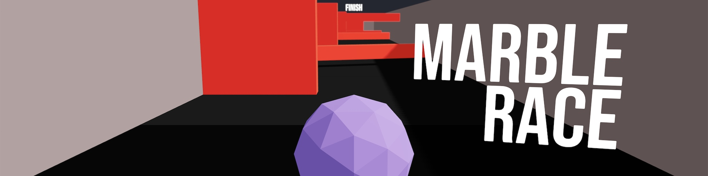
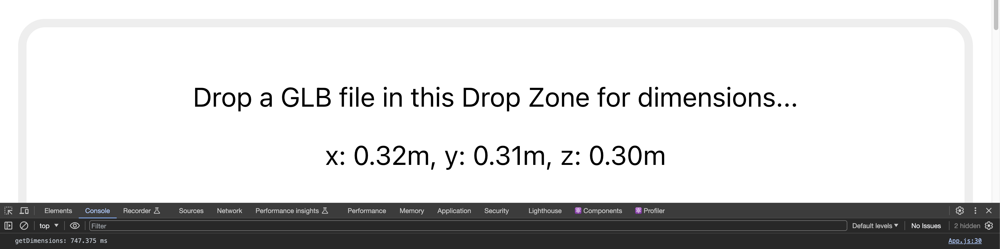

# dvdjrnx.github.io

Hi, I'm David Journeaux, a **front-end developer** and growing **UX/UI designer**. I've created this simple GitHub Pages site to hold a collection of minor projects I've worked on over the years.

To be frank, my most recent professional development and growth has occurred within two private endeavours:

- Building features for **Shopify** as one of their software engineers
- Creating prototypes for my own passion project, **The Altered**.

In light of this, I've not done much that reflects my current skillset within the public sphere. It's my hope this site will help to change that, presenting new, public projects that accurately demonstrate my expertise and learnings in development and user experience with time.

I hope you’ll appreciate and enjoy the journey as much as I intend to myself.

 

## Table of Contents

Three.js learnings

- [Marble Race](#marble-race)

Small prototypes

- [Model Dimension Extraction Test](#model-dimension-extraction-test)

 

## Three.js learnings

 

### [Marble Race](https://dvdjrnx.github.io/marble-race)

**[View GitHub repo](https://github.com/dvdjrnx/marble-race)** • **[View live prototype](https://dvdjrnx.github.io/marble-race)** • Requires keyboard to play

 

 

#### Project description

> **TLDR**: A 3D marble race game made with Three.js and React Three Fiber. **Tech used**: React, Three.js, React Three Fiber, Drei, JavaScript, HTML, CSS

This project brings together many concepts of working with Three.js and React Three Fiber to create an in-browser game controlled by a keyboard.

It features a marble that can be directed via arrow and WASD keys. It can also jump with the space bar. The goal is to move as quickly as possible down a track with multiple, randomized obstacles.

When you first move, a timer begins. Upon reaching the end of the track, the timer stops and shows you your time. You can then restart to beat your previous record.

The work was undertaken as one of many steps in acquiring [my Three.js certification](https://threejs-journey.com/certificate/view/24741) through [Three.js Journey](https://threejs-journey.com/).

Project image

 

[Back to Table of Contents](#table-of-contents) • [Back to top](#dvdjrnxgithubio)

 

## Small prototypes

 

### [Model Dimension Extraction Test](https://dvdjrnx.github.io/model-viewer-dimensions)

**[View GitHub repo](https://github.com/dvdjrnx/model-viewer-dimensions)** • **[View live prototype](https://dvdjrnx.github.io/model-viewer-dimensions)** • Best viewed on desktop

 

 

#### Project description

> **TLDR**: A quick and dirty prototype of a Google Model Viewer-based 3D model dimension extractor. **Tech used**: Google Model Viewer, React, JavaScript, HTML, CSS

This project was a prototyping test explored as part of my 3D and AR/VR work with Shopify. It tested `<model-viewer>`'s `getDimensions()` method for performance viability in a project that required quickly assessing a model's dimensions to facilitate further business logic down the line.

The prototype mounts a `<model-viewer>` instance when a file is dropped on the UI's drop zone, and the `<model-viewer>`'s `src` attribute is set to an object URL of the model. The moment the model loads, `getDimensions()` is called and x, y, and z dimensions are displayed.

Included in the code is a call to `console.time('getDimensions')` that runs on file drop, and a `console.endTime('getDimensions')` call that runs once dimensions are set in state. The results can be viewed in the console tab of Dev Tools and used to help gauge the performance viability of using `<model-viewer>` to get dimensions from models of various file sizes.

UI was not a focus for this test.

Project image

 

[Download a .glb file for testing](https://github.com/dvdjrnx/model-viewer-dimensions/blob/master/public/hamburger-draco.glb)

How to download

 

The link above will take you to a GitHub repository page where you can download a .glb file if you don't have your own for testing. The image below shows where you can find the download button on the linked repository page.

 

[Back to Table of Contents](#table-of-contents) • [Back to top](#dvdjrnxgithubio)

